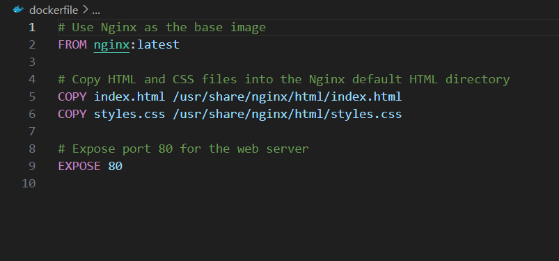

# Containerization and Container Orchestration

In this project, I am developing a simple static website (HTML and CSS) for a company's landing page. The goal is to containerize this application using Docker, deploy it to kubeernetes cluster, and access it through Nginx.

So first thing I did was to create a new project directory with I named "landing-page" and inside the directory I created a HTML file (index.htm) and a CSS file (styles.css).

Then Initialized git in the directory, added, commited and pushed to my remote repo on github.


Next thing I did was to create a dockerfile specifying Nginx as the base image, and copied the HTML and CSS files into the html directory.



Then, I logged into my docker using `docker login -u <my-username>` and then input my password.

Next, I built the image with `docker build -t landing-page .`, tagged it and pushed using

```
docker tag landing-page chikadev/landing-page:v1
docker push chikadev/landing-page:v1
```

The next thing I did was to set up the Kind Kubernetes cluster by first installling Kind (kubernets in docker). Since I'm using a windows machine, I used chocolatey to download kind.

`choco install kind`

Then I created the cluster

`kind create cluster --name landing-page-cluster`


Then I checked if the Kind cluster was running

`kubectl cluster-info --context kind-landing-page-cluster`


Next thing I did was to craete a deployment.yaml file with the following content

```yaml
apiVersion: apps/v1
kind: Deployment
metadata:
  name: landing-page-deployment
spec:
  replicas: 1
  selector:
    matchLabels:
      app: landing-page
  template:
    metadata:
      labels:
        app: landing-page
    spec:
      containers:
        - name: nginx
          image: chikadev/landing-page:v1
          ports:
            - containerPort: 80
```
After that, I applied the deployment to kubernetes

`kubectl apply -f deployment.yaml`

Next, I created the service.yaml file with the following content,

```yaml
apiVersion: v1
kind: Service
metadata:
  name: landing-page-service
spec:
  selector:
    app: landing-page
  ports:
    - protocol: TCP
      port: 80
      targetPort: 80
  type: ClusterIP
```

after which i applied the service file

`kubectl apply -f service.yaml`

The next thing I did was port-forwarding the service to access the landing page locally using the following command.

`kubectl port-forwarding service/landing-page-service 8080:80`

Finally, I accessed the page with the specified port to view my simple frontend application.


#Thank you