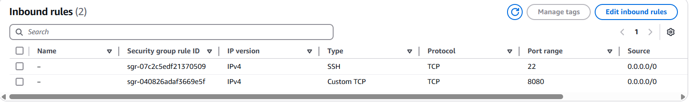
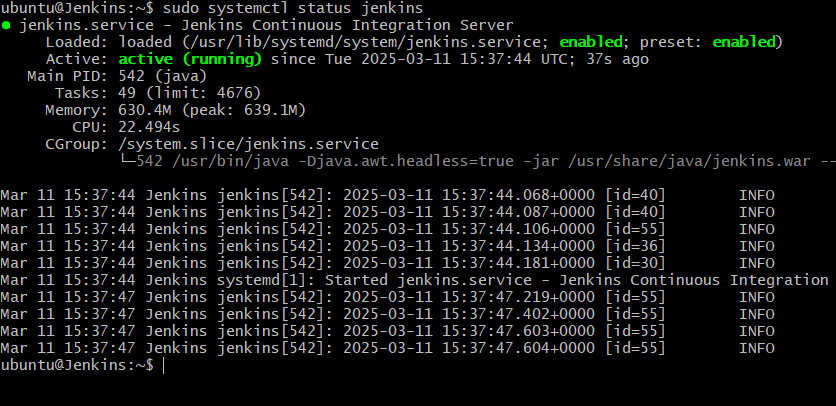
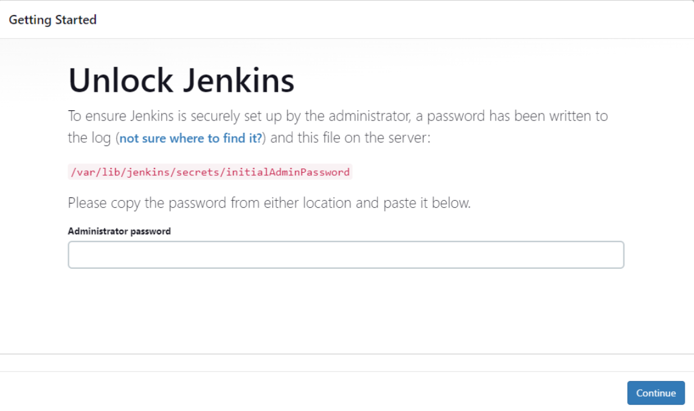

# Automating Deployment of an E-commerce Website

In this project, I am going to implement a CI/CD pipeline using to Jenkins to automate the deployment of web application.

The first thing I did was to provision a newn t2.medium 4gb instace on AWS and opened port 8080 on the security group because thats where Jenkins listens on.



Then I ran the following commands to update the instance, install JDK, then install Jenkins.

`sudo apt update` **# Updtate package repositories**

`sudo apt install default-jdk-headless` **# Install JDK**

**# Install Jenkins**
```
    wget -q -O - https://pkg.jenkins.io/debian-stable/jenkins.io.key | sudo apt-key add -
    sudo sh -c 'echo deb https://pkg.jenkins.io/debian-stable binary/ > \
    /etc/apt/sources.list.d/jenkins.list'
    sudo apt update
    sudo apt-get install jenkins
```

I used this command to check if Jenkins has been installed, and is up and running.

`sudo systemctl status jenkins`



I input my Jenkins instance IP address on my web browser. I typed `sudo cat /var/lib/jenkins/secrets/initialAdminPassword`, and pasted in the text feild.



I clicked next and set login details.

Next, I downloaded Docker in my instance.

The next thing was to connect my Jenkins to github.

Then I confiured the build trigger. I used webhook as my trigger.

The next thing i did was to write my jenkins script using the pipeline syntax generator.

```
pipeline {"\n    agent any\n\n    stages {\n        stage('Connect To Github') {\n            steps {\n                    checkout scmGit(branches: [[name: '*/main']], extensions: [], userRemoteConfigs: [[url: 'https://github.com/RidwanAz/jenkins-scm.git']])\n            "}
        }
        stage('Build Docker Image') {"\n            steps {\n                script {\n                    sh 'docker build -t dockerfile .'\n                "}
            }
        }
        stage('Run Docker Container') {"\n            steps {\n                script {\n                    sh 'docker run -itd -p 8081:80 dockerfile'\n                "}
            }
        }
    }
}
```

Before jenkins can run docker commands, I had to install docker in the same instance where jenkins is installed.

I created a file named docker.sh and pasted the script below.

```
sudo apt-get update -y
sudo apt-get install ca-certificates curl gnupg
sudo install -m 0755 -d /etc/apt/keyrings
curl -fsSL https://download.docker.com/linux/ubuntu/gpg | sudo gpg --dearmor -o /etc/apt/keyrings/docker.gpg
sudo chmod a+r /etc/apt/keyrings/docker.gpg

# Add the repository to Apt sources:
echo \
  "deb [arch=$(dpkg --print-architecture) signed-by=/etc/apt/keyrings/docker.gpg] https://download.docker.com/linux/ubuntu \
  $(. /etc/os-release && echo "$VERSION_CODENAME") stable" | \
  sudo tee /etc/apt/sources.list.d/docker.list > /dev/null
sudo apt-get update -y
sudo apt-get install docker-ce docker-ce-cli containerd.io docker-buildx-plugin docker-compose-plugin -y
sudo systemctl status docker
```

Then I made the file executable using this command

`chmod u+x docker.sh`

Then I executed the file using `./docker.sh`

Next, I creted a dockerfile with the following script

```
# Use the official NGINX base image
FROM nginx:latest

# Set the working directory in the container
WORKDIR  /usr/share/nginx/html/

# Copy the local HTML file to the NGINX default public directory
COPY index.html /usr/share/nginx/html/

# Expose port 80 to allow external access
EXPOSE 80
```

and created index.html file. 

I clicked build now and the pipeline ran successfully.

#Thank you.